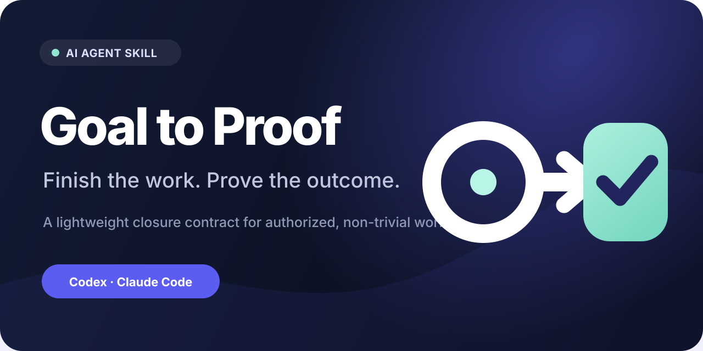

# Goal to Proof

**Make AI agents do the right work, finish it, and prove it.**

[한국어](README.ko.md) · [Website](https://aiopshwang.github.io/goal-to-proof/) · [Methodology](https://aiopshwang.github.io/goal-to-proof/methodology.html) · [Validation](https://aiopshwang.github.io/goal-to-proof/benchmarks.html)



Goal to Proof is a lightweight closure contract for AI agents. It turns authorized, non-trivial work into an observed outcome instead of a plausible completion claim.

It does not give an agent new permissions, choose your goals, or force a heavyweight process onto simple work. It changes exactly one thing — the definition of "done": each in-scope requirement needs direct, scope-matched evidence from the latest relevant state.

```bash
npx skills add aiopshwang/goal-to-proof
```

One command installs the canonical Agent Skills package. Codex and Claude Code marketplace routes are covered in [Install](#install).

## The problem it solves

Agents often stop one boundary too early:

- a plan exists, but the requested change was never made;
- a component passes, but the real integration path was not exercised;
- a file was generated, but the intended audience cannot use it;
- a push succeeded, but the public artifact was never read back;
- a proxy check passed, so the broader outcome was implied rather than observed.

Each of these produces a completion report that reads fine — until you ask for proof. Without a closure contract:

> "The release was pushed successfully."

With Goal to Proof:

> "The release tag exists on the public remote, the release page is readable without repository credentials, and the published archive contains the expected skill files."

The second report is stronger only because those observations were actually made. When direct proof is unavailable, the skill requires precise labels instead: **verified**, **partially verified**, or **not verified**.

## How it works: the closure contract

For work that needs real closure, the skill identifies four things:

1. **Result** — what must be different when the task is done.
2. **Target** — who or what must be able to use or observe it.
3. **Proof** — the most direct practical observation that separates success from plausible-looking failure.
4. **Boundaries** — what is authorized, excluded, or requires new authority.

The agent then chooses the lightest workflow that can reach that result, completes the dependent steps, and maps every completion claim to evidence. The user stays in control while the agent is responsible for execution and verification inside the approved boundary:

| The user owns | The agent owns inside the authorized boundary |
| --- | --- |
| Goals, values, authority, risk tolerance, material choices | Method, sequencing, reversible implementation choices, diagnostics, execution, verification |

## What makes it different

- **A completion gate, not another methodology.** Domain skills still own planning, design, debugging, research, and implementation; Goal to Proof only defines when the work counts as done.
- **Claim-shaped proof discipline.** Evidence must match the scope of the claim and come from the latest relevant state — a convenient proxy check never stands in for the requested outcome.
- **Published, evidence-scoped validation.** The repository ships a public evaluation gate — activation, behavior, and hard-gate cases with recorded results in [`evals/`](evals/) — and claims nothing beyond what those records support.

## When to use it

Use Goal to Proof when a deliverable has dependent steps, crosses an integration or publication boundary, or is likely to stop at a plan, partial artifact, isolated component, or proxy check.

Typical examples include:

- implementing and exercising a user-visible feature;
- fixing a bug and reproducing the original path after the change;
- publishing an artifact and reading the remote state back;
- producing a document, visual, or curriculum and opening the final render;
- completing research whose material claims need traceable primary sources;
- delivering a non-trivial diagnosis, evidence-backed decision memo, or executable plan as the requested result;
- carrying an approved multi-step operation through its actual target environment.

It should not activate implicitly for simple questions, translation or formatting, open-ended ideation, routine self-contained edits with an obvious direct check, or read-only requests whose sole deliverable is an answer and that do not exercise a target workflow. A plan, diagnosis, or decision document can still be a positive case when that non-trivial artifact is itself the requested result.

## Install

### Agent Skills installer

Install the canonical [Agent Skills](https://agentskills.io/specification) package with the portable installer:

```bash
npx skills add aiopshwang/goal-to-proof
```

Choose your agent and installation scope in the prompt. Packaging describes the intended distribution path; consult [validation evidence](https://aiopshwang.github.io/goal-to-proof/benchmarks.html) and release notes for the environments actually exercised.

### Codex marketplace

```bash
codex plugin marketplace add aiopshwang/goal-to-proof
codex plugin add goal-to-proof@goal-to-proof
```

You can inspect configured sources with `codex plugin marketplace list`. Codex marketplace packaging follows OpenAI's [plugin packaging documentation](https://developers.openai.com/plugins/build/plugins).

### Claude Code marketplace

```bash
claude plugin marketplace add aiopshwang/goal-to-proof
claude plugin install goal-to-proof@goal-to-proof
```

In a Claude Code managed plugin install, the skill is namespaced as `/goal-to-proof:goal-to-proof`; a standalone Agent Skills install may expose `/goal-to-proof`. See Anthropic's [marketplace](https://code.claude.com/docs/en/plugin-marketplaces) and [skill](https://code.claude.com/docs/en/slash-commands) documentation.

## Invoke

In Codex, invoke it explicitly when you want closure behavior:

```text
Use $goal-to-proof to carry this approved change through the real target and prove it.
```

The skill may also activate automatically when its description matches a non-trivial closure task. Explicit invocation is useful when the main risk is premature completion.

## Design principles

- **Outcome over artifact:** a generated thing is not automatically a usable result.
- **Claim-shaped proof:** test the scope of the claim, not a convenient proxy.
- **Latest-state evidence:** re-check after the final relevant change.
- **Real boundary when practical:** exercise the actual integration, audience, device, account, render, or remote state.
- **Authority stays with the user:** no publication, spending, disclosure, irreversible action, or scope expansion without authorization.
- **Low ceremony:** simple work stays simple; process appears only when it protects closure.
- **Honest limits:** missing access or evidence narrows the completion claim.

Read the full [product principles](docs/product-principles.md) and [methodology](https://aiopshwang.github.io/goal-to-proof/methodology.html).

## Validation and claims

This project separates three different facts:

1. **Package validity:** manifests and skill structure satisfy their validators.
2. **Host behavior:** a named host can discover, install, and invoke the package in an exercised environment.
3. **Task outcome:** an agent using the skill improves closure on a defined evaluation case.

Passing one layer does not prove the next. See [Benchmarks & validation](https://aiopshwang.github.io/goal-to-proof/benchmarks.html) for the evaluation contract and scoped evidence. No universal productivity or success-rate claim is made.

**What the first live A/B measured** ([full record](evals/results/2026-08-28-live-ab.md)). The same task was given twice under identical conditions — once with the skill reachable, once without — and the two answers were scored by a blind judge on the opposite host.

- On the `B07` fixture with Claude Code and `sonnet`, eight runs per arm: the agent with the skill named its evidence in 8/8 runs against 5/8 without it, and stated its scope honestly in 8/8 against 4/8 (one-tailed Fisher p = 0.038).
- On Codex with `gpt-5.6-sol` at high reasoning effort, both arms were already near-perfect. These cases cannot detect a difference against that baseline.
- Under a prompt that does not name the skill, it activated in 9 of 23 candidate runs, all on one case. Asked for by name it activates every time. **Installing this skill does not, on its own, change what an agent does on most tasks.**

Three to eight runs per cell is a small sample, and the record shows a same-size gap arising between two arms that were behaviorally identical. Read it before quoting any of these numbers.

## Origin and privacy

The initial behavior model was distilled from aggregate analysis of prior real working sessions. The analysis looked for repeated operating patterns such as intent alignment, scope control, autonomous execution inside approval boundaries, end-to-end verification, durable checkpoints, and evidence-first reporting.

Raw conversations were never included in this repository. Personal names, secrets, one-off preferences, private content, session transcripts, and private corpus metadata were excluded from the published skill. The source material informed the design; it is not a performance benchmark.

## Project map

```text
skills/goal-to-proof/          Canonical Agent Skill
.codex-plugin/                 Codex plugin manifest
.agents/plugins/               Codex marketplace catalog
.claude-plugin/                Claude Code plugin and marketplace metadata
evals/                         Behavior cases and evaluation data
tests/                         Package and policy checks
docs/                          GitHub Pages source
```

The repository root is the plugin root. There is one canonical `SKILL.md`; platform packages point to it rather than maintaining divergent copies.

## aiopshwang skill family

Independent, evidence-first Agent Skills that work well together:

- [verify-regression-tests](https://github.com/aiopshwang/verify-regression-tests) — prove that a regression test actually detects its intended defect.
- [ship-mobile-app](https://github.com/aiopshwang/ship-mobile-app) — production mobile work across domain, state, lifecycle, platform, and release boundaries.
- [data-analysis-ml-agent-skills](https://github.com/aiopshwang/data-analysis-ml-agent-skills) — decision-grade data analysis and ML: audits, leakage-safe experiments, validation, reproducible handoff.
- [fresh-eyes-check](https://github.com/aiopshwang/fresh-eyes-check) — a context-free second model checks whether an earlier instruction still fits before you act on it.

`evidence-first-problem-solving` was merged into this skill at v1.1.0; its
diagnosis loop lives in
[references/diagnosis-and-proof.md](skills/goal-to-proof/references/diagnosis-and-proof.md).

## Contributing

Issues and focused pull requests are welcome. Behavioral changes should include a case that would fail without the change and should preserve non-trigger behavior for simple work. See [CONTRIBUTING.md](CONTRIBUTING.md) and the [Code of Conduct](CODE_OF_CONDUCT.md).

## License

[MIT](LICENSE) © Hyunsik Hwang (`aiopshwang`).
